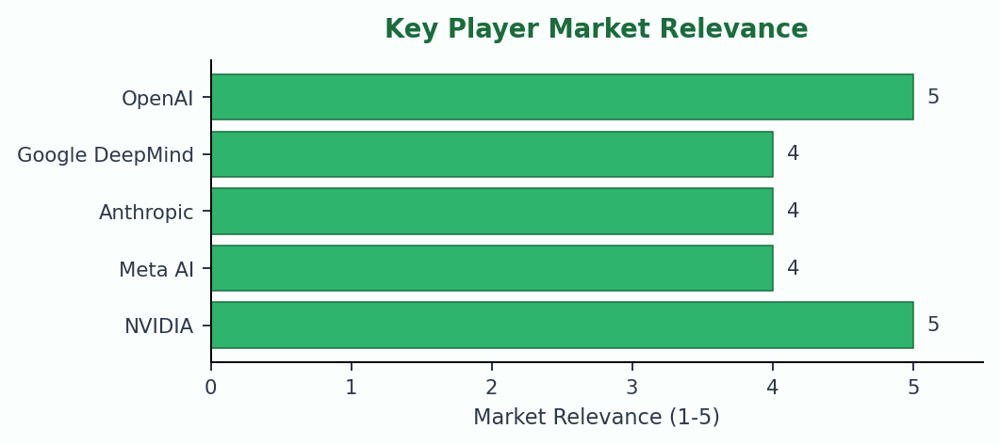
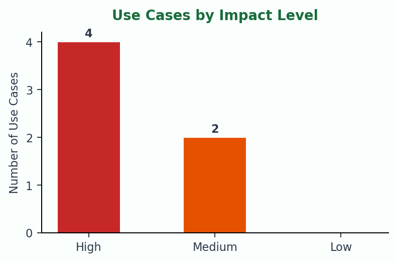
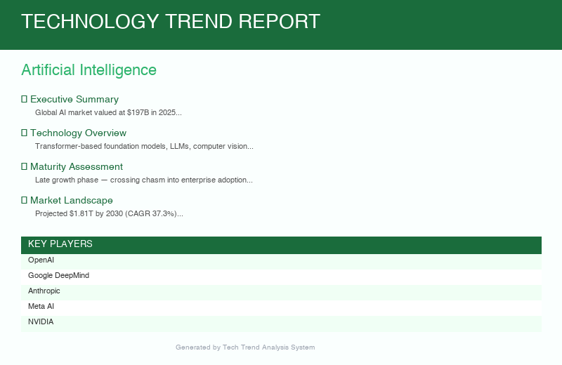

# Tech Trend Report Agent

An AI-powered multi-agent system that generates technology trend reports. Enter any technology — Artificial Intelligence, Blockchain, Quantum Computing — and get a professional Word document with market analysis, key players, use cases, and strategic outlook.


---

## Sample Report Charts

Charts are generated from the analysis output and embedded directly into the DOCX report. Examples from the bundled `Artificial Intelligence` mock data:

**Key Player Market Relevance** — horizontal bar chart ranking leading companies


**Use Cases by Impact Level** — distribution of identified use cases across impact tiers


---

## Architecture

```
CLI Input ("Quantum Computing")
        │
        ▼
┌─────────────────────┐
│    Orchestrator      │  Coordinates the 3-phase pipeline
└────────┬────────────┘
         │
    ┌────┴─────┐
    ▼          ▼
┌────────┐ ┌──────────┐
│Research│ │ Analysis │
│ Agent  │ │  Agent   │
└────┬───┘ └────┬─────┘
     │          │
     ▼          ▼
┌─────────────────────┐
│   Report Generator   │ → DOCX Output
└─────────────────────┘
```

| Agent | Role | Technology |
|-------|------|-----------|
| **ResearchAgent** | Gathers live web intelligence on the technology | Server-side web search, adaptive thinking |
| **AnalysisAgent** | Extracts structured insights from raw research | Structured outputs (Pydantic), adaptive thinking |
| **ReportGenerator** | Produces a professional multi-page DOCX report | python-docx with color-coded tables |

---

## Quickstart

```bash
# 1. Clone the repo
git clone https://github.com/eugen-goebel/tech-trend-agent.git
cd tech-trend-agent

# 2. Install dependencies
pip install -r requirements.txt

# 3a. Test without an API key (uses sample AI data)
python main.py --dry-run

# 3b. Full run with Anthropic API key
echo "ANTHROPIC_API_KEY=sk-ant-..." > .env
python main.py "Quantum Computing"
python main.py "Blockchain"
python main.py "Edge Computing"
```

The report is saved to `./output/tech_trend_<technology>_<date>.docx`.

---

## Testing

```bash
# Run the full test suite (52 tests, no API key needed)
python -m pytest tests/ -v
```

The test suite covers:
- **Model validation** — Pydantic schemas, Literal constraints, serialization
- **Mock data integrity** — ensures dry-run data is complete and valid
- **Report generation** — DOCX output, section presence, table structure
- **Agent logic** — web search tool usage, pause_turn handling, structured outputs
- **CLI integration** — argument parsing, dry-run mode, error handling

---

## Example Output

Running `python main.py "Artificial Intelligence"` produces a ~10-page Word document:

<p align="center">
  
</p>

---

## Project Structure

```
tech-trend-agent/
├── main.py                       # CLI entry point (supports --dry-run)
├── agents/
│   ├── researcher.py             # Web search intelligence gathering
│   ├── analyst.py                # Structured analysis (Pydantic models)
│   ├── orchestrator.py           # Pipeline coordinator
│   └── mock_data.py              # AI sample data for --dry-run mode
├── utils/
│   └── report_generator.py       # Professional DOCX generation
├── tests/
│   ├── test_models.py            # Pydantic model validation tests
│   ├── test_mock_data.py         # Mock data integrity tests
│   ├── test_report_generator.py  # DOCX generation tests
│   ├── test_agents.py            # Agent logic tests (mocked API)
│   └── test_cli.py               # CLI integration tests
├── output/                       # Generated reports (git-ignored)
├── requirements.txt
└── .env.example
```

---

## Tech Stack

| Component | Technology |
|-----------|-----------|
| AI Backend | Anthropic API (claude-opus-4-6) |
| Structured Outputs | Pydantic v2 + `messages.parse()` |
| Server-side Search | `web_search_20260209` tool |
| Report Generation | python-docx |
| Testing | pytest (52 tests) |
| Thinking Mode | Adaptive thinking |

---

## Report Sections

1. **Cover Page** — Technology name, date, system branding
2. **Executive Summary** — High-level overview
3. **Technology Overview** — How the technology works
4. **Maturity Assessment** — Adoption lifecycle stage
5. **Market Landscape** — Market size, growth, regional split
6. **Key Players** — Major companies with focus areas (table)
7. **Use Cases** — Real-world applications with impact levels (color-coded table)
8. **Strengths & Limitations** — Two-column comparison table
9. **Adoption Drivers & Barriers** — Two-column comparison table
10. **Key Trends** — Current industry developments
11. **Future Outlook** — 3-5 year predictions
12. **Risk Factors** — Threats and challenges

---

## License

MIT License — see [LICENSE](LICENSE)
